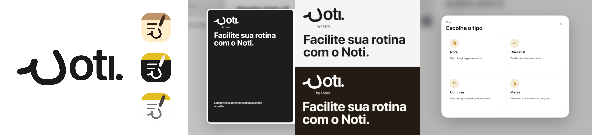
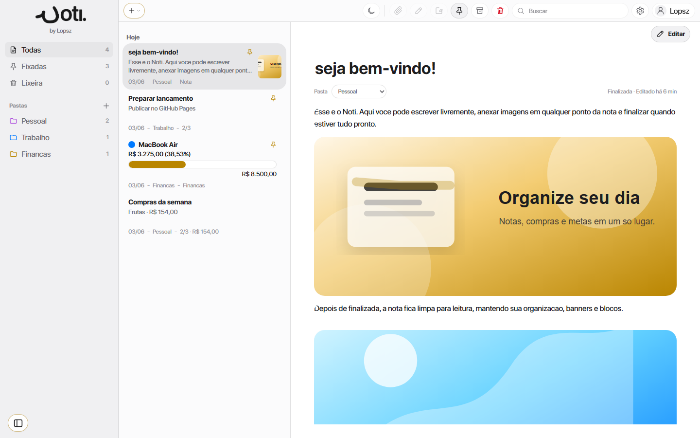
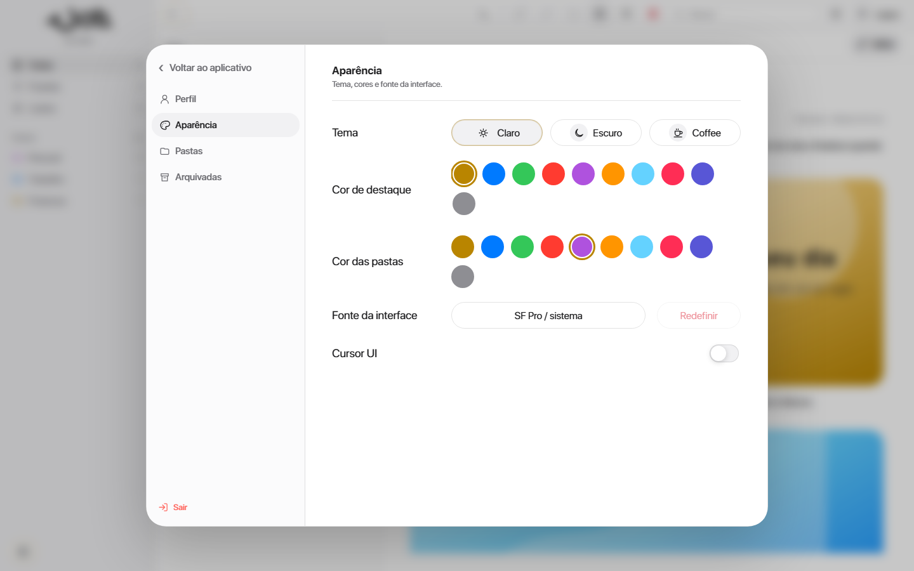

# Noti.

Noti. é um aplicativo web de produtividade feito para organizar notas, checklists, listas de compras e metas em uma experiência local, visual e focada em desktop.

O projeto foi desenhado com uma estética minimalista inspirada no macOS, com interface limpa, temas personalizáveis, organização por pastas, anexos, lixeira, arquivos fixados e armazenamento persistente no navegador.

## Prévia

  

  

  

  

## Funcionalidades

- Notas inteligentes com texto livre, imagens em banner e anexos.
- Checklists com itens marcáveis, progresso e suporte a imagem por item.
- Listas de compras com quantidade, moeda, valor por item e total automático.
- Metas financeiras com progresso, recomendações e gráfico visual.
- Pastas, notas fixadas, arquivamento e lixeira com recuperação.
- Organização por arrastar notas, blocos, itens de checklist e compras.
- Busca avançada por título, conteúdo, pasta, itens e anexos.
- Conta local com perfil, foto, telefone, usuário obrigatório com `@` e estatísticas.
- Personalização de tema, cor de destaque, cor de pastas, fonte da UI e cursor.
- Modo claro, escuro e coffee.
- Desenho livre, marca-texto, blocos de desenho, desfazer e refazer traços.
- Salvamento persistente usando `localStorage`.

## Experiência

O Noti. funciona como um app de notas moderno no navegador. O usuário pode criar uma nota, finalizar para leitura, voltar para edição, anexar mídia, montar listas de compras, acompanhar metas e organizar tudo em pastas.

Os dados ficam salvos localmente no navegador, então o app continua com as informações mesmo depois de fechar e abrir a página novamente.

## Tecnologias

- HTML5
- CSS3
- JavaScript puro
- LocalStorage
- GitHub Pages

## Como usar

1. Abra o site pelo GitHub Pages ou localmente pelo `index.html`.
2. Use o botão de criação no topo para escolher entre nota, checklist, compras ou metas.
3. Organize seus conteúdos em pastas, fixe itens importantes e arquive quando precisar.
4. Use anexos, desenho e marca-texto para enriquecer suas notas.
5. Finalize uma nota quando quiser bloquear a edição e deixar o conteúdo em modo leitura.

## Observações

O Noti. salva contas, preferências e conteúdos apenas no navegador atual. Não há sincronização em nuvem.

Anexos também são salvos localmente, então arquivos muito grandes podem ocupar bastante espaço no navegador.

## Autor

Desenvolvido por **Lopsz**.

## Licença

Este projeto está licenciado sob a licença MIT. Consulte o arquivo [LICENSE.md](LICENSE.md) para mais detalhes.
